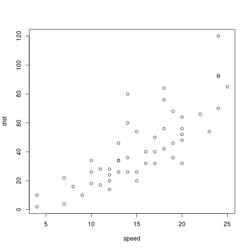
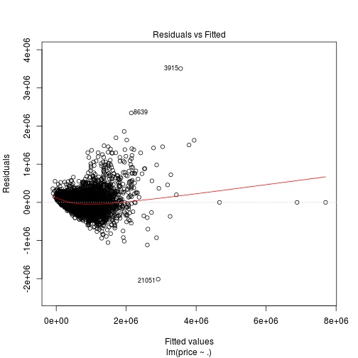
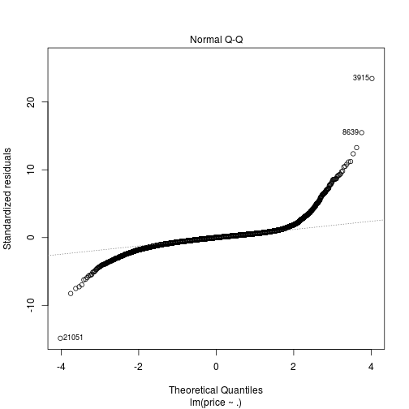
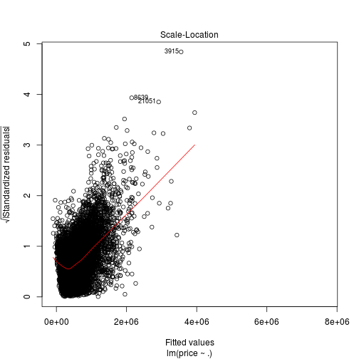
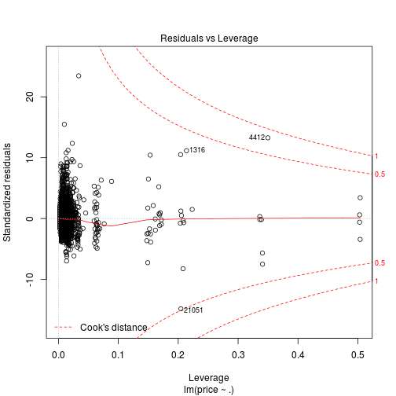

King-County-House-Price-Prediction
========================================================
author: Harish k Rongala
date: October 14th 2017
autosize: true

Introduction
========================================================

For more details on authoring R presentations please visit <https://support.rstudio.com/hc/en-us/articles/200486468>.

- Bullet 1
- Bullet 2
- Bullet 3

Data
========================================================


```r
source('workingScript.R')
str(houseData)
```

```
'data.frame':	21613 obs. of  22 variables:
 $ id           : num  7.13e+09 6.41e+09 5.63e+09 2.49e+09 1.95e+09 ...
 $ date         : Factor w/ 372 levels "20140502T000000",..: 165 221 291 221 284 11 57 252 340 306 ...
 $ price        : num  221900 538000 180000 604000 510000 ...
 $ bedrooms     : int  3 3 2 4 3 4 3 3 3 3 ...
 $ bathrooms    : num  1 2.25 1 3 2 4.5 2.25 1.5 1 2.5 ...
 $ sqft_living  : int  1180 2570 770 1960 1680 5420 1715 1060 1780 1890 ...
 $ sqft_lot     : int  5650 7242 10000 5000 8080 101930 6819 9711 7470 6560 ...
 $ floors       : num  1 2 1 1 1 1 2 1 1 2 ...
 $ waterfront   : int  0 0 0 0 0 0 0 0 0 0 ...
 $ view         : int  0 0 0 0 0 0 0 0 0 0 ...
 $ condition    : int  3 3 3 5 3 3 3 3 3 3 ...
 $ grade        : int  7 7 6 7 8 11 7 7 7 7 ...
 $ sqft_above   : int  1180 2170 770 1050 1680 3890 1715 1060 1050 1890 ...
 $ sqft_basement: int  0 400 0 910 0 1530 0 0 730 0 ...
 $ yr_built     : int  1955 1951 1933 1965 1987 2001 1995 1963 1960 2003 ...
 $ yr_renovated : int  0 1991 0 0 0 0 0 0 0 0 ...
 $ zipcode      : int  98178 98125 98028 98136 98074 98053 98003 98198 98146 98038 ...
 $ lat          : num  47.5 47.7 47.7 47.5 47.6 ...
 $ long         : num  -122 -122 -122 -122 -122 ...
 $ sqft_living15: int  1340 1690 2720 1360 1800 4760 2238 1650 1780 2390 ...
 $ sqft_lot15   : int  5650 7639 8062 5000 7503 101930 6819 9711 8113 7570 ...
 $ howOld       : num  60 24 82 50 28 14 20 52 55 12 ...
```

Relationship among the variables
========================================================



Linear model
========================================================


